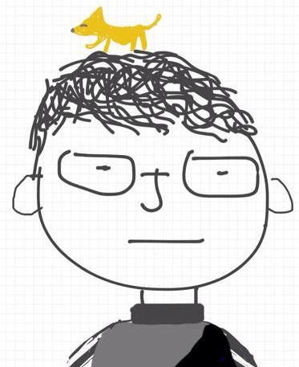
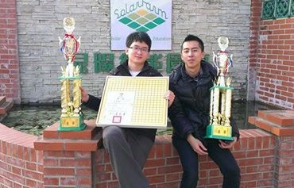

<figure class="half">
  
  <figcaption>Chi-Ju Wu, Taiwan, 10/23/1990</figcaption>
</figure>

I am a Computer Science student at CU Boulder who finds joy in creating products that delight and help people. Love to take on any challenge and explore more about our new tech world!

## Work Experience
Software Engineer at [Orbbec 3D Technology](https://orbbec3d.com/) [Jun 2019 - Aug 2019]
* Designed and implemented an extrinsic calibration algorithm for little-overlapping dual-camera systems
* Developed and maintained [Orbbec ROS package](https://github.com/orbbec/ros_astra_camera)

Firmware Engineer at [Actions Microelectronics](https://www.actions-micro.com/about.php?l=en) [Dec 2017 - March 2018]
* Devoloped wifi display functions of [EZCast](https://www.iezvu.com).

Software Engineer at [DMP Electronics](http://www.compactpc.com.tw/about_us.aspx) [Oct 2014 - Aug 2014]
* [86Duino Motion Editor](https://github.com/Sayter99/86ME): Developed a frame-based motion editor for multi-functional robots.
  * Supported various input devices, such as the keyboard, WiFi, Ethernet, Bluetooth, and PS2 joystick, for controlling robots.
  * Integrated inertial measurement units (IMU) that can help robots resist shocks and vibrations
  * Implemented approaches to generate cubic splines for smoothing the trajectory of servo motors
  * Designed and implemented the two-layer motion blending feature for creating more flexible motions
  * Implemented templates to automatically generate firmware that replaces manual coding work
  * Integrated firmware with Scratch 2.0 that users can program their robots with graphical blocks
  * Applied to two 3D-printable robots, including a hexapod, 86Hexapod, and a biped robot

* 86Duino SDK
  * [Linux SDK](https://github.com/roboard/86Duino_Linux_SDK): allow users to manipulate 86Duino I/Os in Linux environment
  * [libMRAA Porting](https://github.com/Sayter99/mraa): allow users to manipulate I/Os with C/C++, Java, Python or JavaScript
  * [AIServo86](https://github.com/roboard/86Duino/tree/master/hardware/86duino/x86/libraries/AIServo86): a library of controlling smart actuators such as Dynamixel servos

* Robots
  * Designed and implemented firmware of 3D-printable robots including a hexapod and a humanoid robot
  * Built internal packages to integrate ROS with the 86Duino ecosystem

## Education
[University of Colorado Boulder](https://www.colorado.edu/)
* Master in Computer Science, GPA 4.00/4.00 [2018 - 2020]
  * Human Interruption Detection in HRC
    * Developed an approach to allow robots to detect users’ intention to interrupt a robot mid-execution based on visual and audio signals. The goal is to improve interactivity in Human-Robot Collaboration tasks.
      * Implemented Dynamic Safety Margin controller on Sawyer based on MoveIt! and KDL
      * Developed a system to detect the beginning of interruptions using OpenFace
  * 1/10-scale Mini Race Car
    * Designed and developed an autonomous system integrating Rock64, RealSense D435i, and Pololu controller.
      * Implemented a remote control and debugging package to speed up development
      * Implemented a state machine using depth data to achieve the fastest record in class to complete a route
      * Integrated ORB Slam with RealSense to create sparse map while moving
  * [HIRO-group](https://hiro-group.ronc.one/) Research Assistant
    * Developed infrastructures including motion control interfaces, sensor integration, and simulation

[National Chiao Tung University](http://www.nctu.edu.tw)
* Master in Computer Science, GPA 4.00/4.00 [2013 - 2014]
  * Publication
    * Chi-Ju Wu, and Wen-Hsiang Tsai, “Construction and Applications of Message-rich Videos for Pervasive Communication,” Proceedings of 2014 Conference on Computer Vision, Graphics and Image Processing, Pintung, Taiwan, Aug. 2014.
      * Proposed and implemented an approach to embed and extract hidden messages in videos. It can extract messages via capturing videos directly from monitors with 98.8% correctness
* Bachelor in Computer Science, GPA 3.75/4.00 [2009 - 2013]
  * Activities
    * Cheerleader: First Prize in University Cheerleading Championship (Division 2), Taiwan, 2011.
    * Go: The fourth in National University Go Competition (Division 2d), Taiwan, 2010.

# Selected Projects
* [See more about my projects](../assets/images/old/Projects.pdf)

# More about me
I am also a [Go](https://en.wikipedia.org/wiki/Go_(game)) player, game player, and I like sports such as basketball, bicycle.

* In Taiwan, I am a [5-Dan](https://en.wikipedia.org/wiki/Go_ranks_and_ratings) Go player.

* Got the 1st of University Cheerleading Championship Division 2 in Taiwan, 2011.

