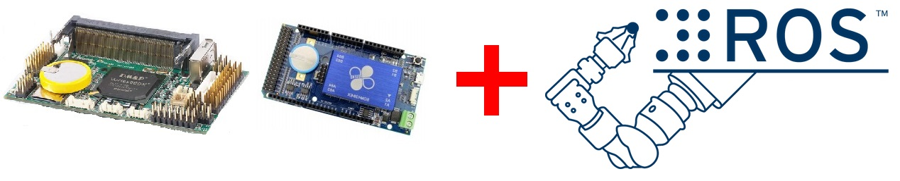

最近要幫忙 **86Duino** 製作 Lubuntu 10.04 的 Image，之前在用 **RoBoard** 玩 ROS(Robot Operating System) 時就有做一些簡易的筆記，恰巧能派上用場，所以想藉由這次機會好好整理之前的一些心得讓之後想使用 RoBoard/86Duino 來玩 ROS 的玩家可以更輕易的上手。

## 甚麼是 ROS？
那麼我們先來介紹一下 ROS，Robot Operating System 這名字可能會讓人覺得是一套 OS，不過 ROS 實際上更像是一個框架，包含許多方便開發機器人軟體的工具、函式庫和現成的套件。而我認為最重要的是 ROS 擁有龐大的社群，許多人使用 ROS] 並且會將自己的套件、專案開源，造就了如今的榮景，至於更多詳細的資訊可以上 ROS 的官方網站去看。

## 當 ROS 遇上 RoBoard/86Duino

RoBoard 是一款專為控制機器人設計的開發板，而 86Duino 是一個與 Arduino 相容的板子，其中 86Duino One 小弟認為也是很適合拿來控制伺服馬達的。為了避免內容過於發散，RoBoard 與 86Duino 的詳細介紹就請大家去官網看了。

### ROS 版本的選擇
[安裝 ROS](http://wiki.ros.org/jade/Installation/Ubuntu) 的版本基本上是會跟作業系統版本有關聯的，舉最新版 ROS Jade 來說， Jade 對 Ubuntu 僅僅支援 `14.04、14.10、15.04` 這三個版本，所以如果選擇舊版的 Ubuntu，就只能安裝較舊的 ROS。例如選擇 Ubuntu 10.04，能安裝的最新版為相對較舊的 ROS Fuerte。但無可奈何的是 Ubuntu 12 版之後沒有 PAE 是無法正常啟動的，也因為這個原因 RoBoard 與 86Duino 能安裝最新的 Ubuntu 版本即為 10/12 版。接著為了在有限的資源中有最好的表現，更輕量的 [Lubuntu](http://lubuntu.net/) 是一個不錯的選擇。那麼我想大家心裡都會有個問題：`這樣會有哪些影響呢？`最直接的是隨著 ROS 不斷的改版，許多套件在舊版難有更新的機會，或有些新套件是在舊版找不到的，且 ROS 本身的建置方式也會隨著版本改變，現在所開發的程式可能無法直接轉換到新版。
面對這些問題，我在離開學校後才慢慢有了體悟，因為以前從沒碰過機器人，在學校要做實驗總是用最高規格的硬體。但機器人的成本高昂，在選擇硬體上必定要有所取捨，RoBoard、86Duino 可以說是非常好的選擇，擁有許多保護（e.g. 電源反插保護）、腳位豐富、硬體功能包山包海、I/O 速度快、官方論壇資源多，而且是以工控規格打造的，耐用不容易壞！雖然沒有 GPU 是蠻遺憾的，但我認為這不失為一個好選擇。用 RoBoard 和 86Duino 已經足以開發出各式各樣的機器人了；另外，面對 ROS 的不斷更新 ROS2 又即將出世，日新月異的技術，保持自己不斷學習的心態我想是必要的，無論是面對新舊版本的 ROS，都要有能快速學習並熟悉的自信！勇敢開始動手做，我深信這些經驗以後也會很有價值的，說了那麼多，也算是提醒自己寫文的方向能夠具有更高層的意義，期許接下來的文章能夠讓大家能夠有些收穫囉！

## Reference
* [RoBoard](http://www.roboard.com)
* [86Duino](http://www.86Duino.com)
* [ROS](http://www.ros.org)