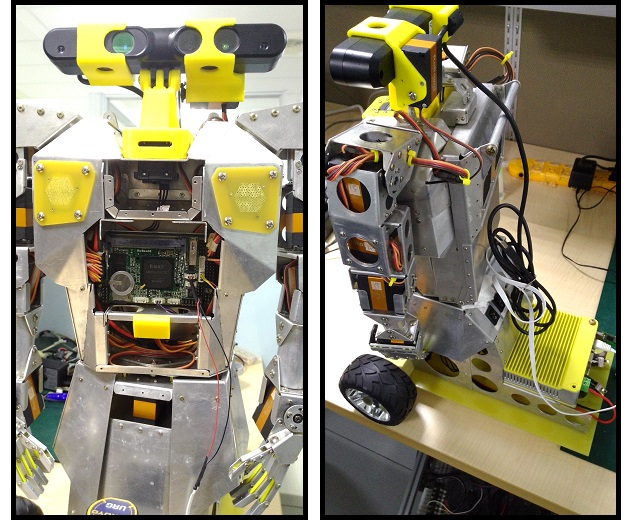
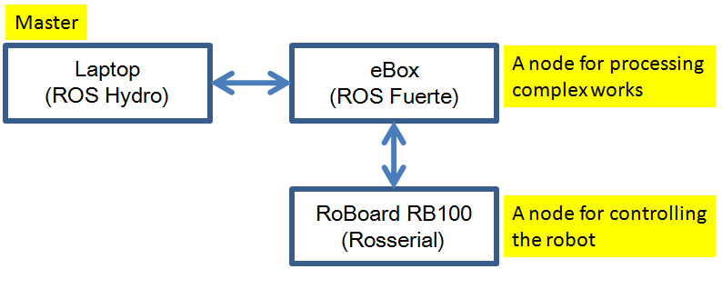

共遊機器人世界當然要找個機器人結伴啦，一起來看看我的這台機器人吧！

## My Partner!

這隻機器人是我去年的聖誕禮物，當時 ROS Indigo 出了一段時間，不過因為 ROS Hydro 上面的文章還是比較豐富一些，我就以下面這樣的架構開始來嘗試一些 ROS 套件。

我是拿一台筆電來當作 Master node，負責蒐集機器人身上傳感器的資訊加以運用，也可以利用這些資訊來決定機器人接下來要做哪些事情；而 eBox 則是透過 wifi 網路與 laptop 溝通，一方面可以收取 laptop 的控制命令傳給 RoBoard 執行，一方面可以幫 RoBoard 負載平衡，把一些需要計算或較耗 CPU 資源的工作吃下來；而 RoBoard 搭配 [RoBoIO](http://www.roboard.com/Files/Code/RoBoard_Training_SW_v18b.pdf) 控制伺服馬達很方便，所以就拿來接收控制方面的指令來控制機器人。接著我們也來看一下這台機器人的其他裝備：

* **Servo**：機器人的雙手是四軸的手臂，伺服馬達是 [RS-1270](http://www.roboard.com/Files/RS-1270/RoBoard_RS-1270.pdf)，手掌還有一顆伺服馬達可以控制手的開合。腰部、頭部也都有馬達控制，而輪子則是由兩顆 [AX-12](http://support.robotis.com/en/product/dynamixel/ax_series/dxl_ax_actuator.htm) 來控制。
* **Sensor**：頭部搭載 [Asus Xtion PRO LIVE](https://www.asus.com/tw/3D-Sensor/Xtion_PRO_LIVE/)。身體前方還有一台 [Hokuyo URG-04LX](https://www.hokuyo-aut.jp/02sensor/07scanner/urg_04lx.html)。
* **Battery**：前輩幫我在露天買的兩顆鋰電池，是模型玩具在用的那種，因為我也看不出廠牌就沒寫上來 >__<。一顆是給 eBox，一顆是給 RoBoard。

接下來談談 ROS 之間的溝通，laptop 的 Hydro 與 eBox 的 Fuerte 溝通上，可能會出現 [ROS message](http://wiki.ros.org/Messages) 有些型別是其中一方沒有的狀況，這時候就必須在程式裡多做一次轉換，雖然有些麻煩跟效能上的損失，但基本上比較少遇到，即便遇到也都是可以解決的。而 RoBoard 上裝的 OS 為 *Free DOS*，依靠 [Rosserial](http://wiki.ros.org/rosserial) 來與 eBox 的 Fuerte 溝通。大家可能會很好奇 Rosserial wiki 頁上沒有 **rosserial_dos**，這邊我是利用 *DY Hung* 大大幫忙 porting 的版本，在[小弟的 github](https://github.com/Sayter99/rosserial) 上可以找得到，用來控制 86Duino 和 Free DOS 都沒問題，不過版本停在 Indigo 的樣子，應該不會繼續更新上去。

呼，今天一口氣貼了好多 link（羞愧），之後應該會慢慢剖析整個 ROS 如何運作這台機器人，不過小弟實在要好好構思該怎麼寫>"<，接下來可能也會穿插一些 86ME、86Duino 的戲分。