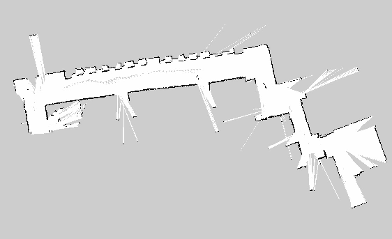

除了運動學外，ROS 上的 SLAM 套件也是非常兇猛的。這邊會簡介幾個不同種類的 SLAM，並說說我那快樂夥伴的 2D SLAM 唷！

## 3D SLAM
我個人有用過的有 [RTAB-Map](http://introlab.github.io/rtabmap/) 和 [Rgbdslam](http://felixendres.github.io/rgbdslam_v2/)。如果要應用在機器人身上，建議選擇適當的解析度（例如 QVGA、QQVGA ）傳深度圖與彩色圖回到桌電或筆電上，再利用 [depth_image_proc](http://wiki.ros.org/depth_image_proc) 把深度圖轉為點雲圖再開始做 3D SLAM。

## Graphic SLAM
僅用過 [ORB-SLAM](http://webdiis.unizar.es/~raulmur/orbslam/)，是只需要一個 camera 就可以完成的 SLAM，我個人認為是不錯的室外 SLAM 解法。因為紅外線不適合在室外使用，所以利用圖像特徵點與圖型理論結合真的是很棒的想法！

## 2D SLAM
因為小弟的快樂夥伴沒裝 encoder 在輪子上，所以就沒有使用 [gmapping](http://wiki.ros.org/gmapping)，而是使用 [hector_mapping](http://wiki.ros.org/hector_mapping)。但我個人是建議大家將輪子裝上 encoder 並且嘗試 gmapping 看看，效果應該是很不錯的，印象中使用 Kinect 來當作 Laser Scanner 就能有不錯的效果，而且機器人還是必須要有反饋才方便進行 debug 等工作。

言歸正傳，我仰賴著高精度的 Hokuyo URG_04LX 來嘗試 2D SLAM，設定可以參考[這篇文件](http://wiki.ros.org/hector_slam/Tutorials/SettingUpForYourRobot)。實做上，我將 Laser Scanner 的資訊由 eBox 的 ROS Fuerte 傳遞到 laptop 上，再交由運算能力較強的 laptop 執行 hector_mapping，以免 eBox 無法負擔計算量。

## DEMO 影片與結果圖


