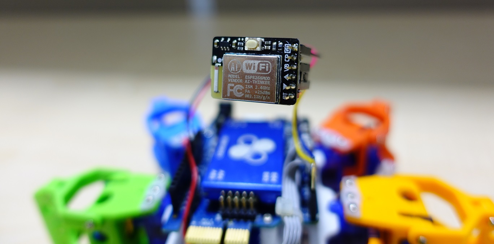
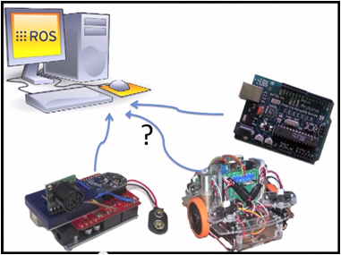
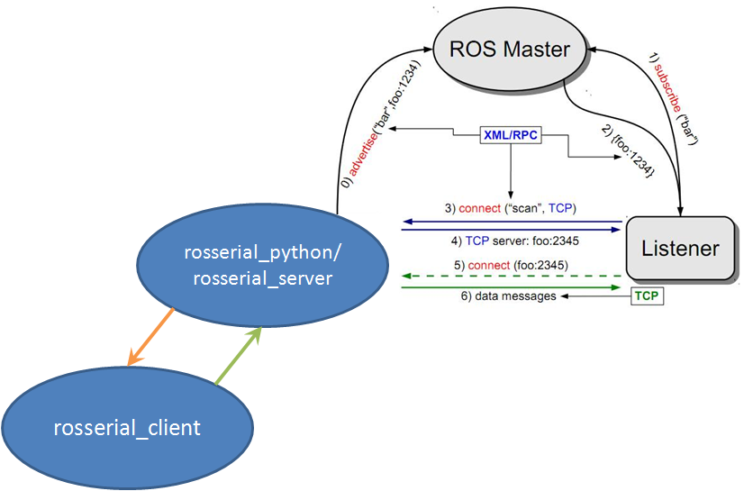

好久不見！最近忙著改版 86ME 和嘗試 86Duino + ESP8266 + [Rosserial86](http://www.86duino.com/?p=10818&lang=TW) 的組合，來達成控制多台 86Hexapod 的目標，今天也來和大家分享吧！

## ESP8266


ESP8266 是一塊小巧便宜的電路板，也因此成為 Arduino 社群製作 Wifi 相關專案時經常採用的選擇。除了能讓 Arduino 連上無線網路，ESP8266 本身也能作為 AP，功能可以說是非常強大。關於 ESP8266 的相關教學已經有許多大大寫了，所以這邊就不提了。要拿 ESP8266 與 86Duino 連接的話，我是用[這款 ESP8266](https://tw.bid.yahoo.com/item/blkbox-me%E5%8E%9F%E8%A3%9D%E3%8A%A3%E5%93%81-ESP8266-Wifi-%E6%A8%A1%E7%B5%84-UART%E4%BB%8B%E9%9D%A2-ardui-100042602874)，將 TX/RX 與 Serial1 的 RX/TX 接上，並且接上地與電（我選擇 3.3V）就算完成硬體部分。軟體的話要注意的是這款 bb-8266 預設的 baudrate 為 115200，請記得要設定正確。86Duino Libraray 的部分我是使用 [WeeESP8266](https://github.com/itead/ITEADLIB_Arduino_WeeESP8266)。在使用 Rosserial86 之前建議先用 AT Command 確認 ESP8266 有正確的運作。

## Rosserial86


Rosserial86 其實已經在之前的文章中出現過了！不過那時候沒有寫得很詳細，所以這一次會提得更深入一些。Rosserial86 是由 [Rosserial Package](http://wiki.ros.org/rosserial) Porting 而來，讓 86Duino 能夠與 ROS 中的 Topic 溝通。那麼為何不讓直接跑 ROS 來溝通呢？雖然 L86duntu 有提供這樣的功能，但某些方面的應用並不需要使用像 Ubuntu 一樣那麼龐大的 OS，只需要一般 86Duino 的環境就可以解決了，這樣的情況下，選擇 Rosserial86 是更加簡潔有力的，Rosserial86 正好提供了簡單快速的方式來與 ROS 溝通，傳輸的介面包含 Serial Port、Ethernet、WiFi(ESP8266)。而當時製作的版本為 **ROS Indigo**，後面的版本雖然沒有實測過，但理論上應該都可以正常運作。


簡單介紹之後，就來談談 Rosserial86/rosserial 是如何運作的，首先，ROS 端（通常為 PC）上要開啟一個 node 來當作與嵌入式裝置溝通的伺服端，**ROS Hydro** 後可以選擇 rosserial_python 或 rosserial_server，這個 node 與嵌入式裝置（86Duino/Arduino）會透過自定義的 protocol 進行溝通。而 rosserial_arduino、rosserial_embeddedlinux、rosserial_86duino 則都隸屬於 rosserial_client，由上面的架構圖可見。

## ROS-side
總結上一段來說，ROS 端要先安裝 rosserial 這個 package，要建立連線時先開啟 roscore 和 [rosserial_python](http://wiki.ros.org/rosserial_python) 或 [rosserial_server](http://wiki.ros.org/rosserial_server)，視連線方式來決定指定如何下，舉 rosserial_python 為例，用 *serial port* 時為 `rosrun rosserial_python serial_node.py /dev/ttyXXX`，用 *ehternet/wifi* 時為 `rosrun rosserial_python serial_node.py tcp`，預設的 port 為 `11411`，有需要變更可在下參數調整。而 rosserial_server 則分為 serial_node 與 socket_node。這次進行多台連線我是採用 rosserial_server socket_node 走預設的 port。

## Connect with ROS
搞定無線網路與 ROS 段設定之後，就可以利用新改好的 [Rosserial86](https://github.com/Sayter99/rosserial) 與 ROS 連線囉！範例程式：
```cpp
#include <ros.h>
#include <std_msgs/String.h>
#include <geometry_msgs/Pose2D.h>

ros::NodeHandle nh;

void messageCb( const std_msgs::String& cmsg){
  Serial.println(cmsg.data);
}

geometry_msgs::Pose2D msg;
ros::Publisher chatter("chatter2", &msg);

ros::Subscriber<std_msgs::String> sub("chatter", &messageCb );
double a[3] = {0};
void setup()
{
  nh.getHardware()->setESP8266(Serial1, 115200);
  nh.getHardware()->setWiFi("SSID", "PASSWORD");
  nh.initNode("IP OF ROSSERIAL SERVER");
  nh.advertise(chatter);
  nh.subscribe(sub);
}

void loop()
{  
  msg.x = a[0]++;
  msg.y = a[1]++;
  msg.theta = a[2]++;
  chatter.publish( &msg );
  nh.spinOnce();
  delay(50);
}
```
上面的範例會讓 86Duino 發送模擬的位置訊息到 chatter2 這個 topic，並接收 chatter 這個 topic 送來的訊息，簡單測試完畢之後，就能把多台 86Hexapod 連上 ROS 並且一起控制了。除了一次控制多台小六足外，有興趣的玩家還能利用 ROS 上豐沛的資源來製作各種不同的功能唷！



## Robots Exercise
基於上述的基礎，大家異想天開的要在公司尾牙表演機器人版的妖怪體操 XD

