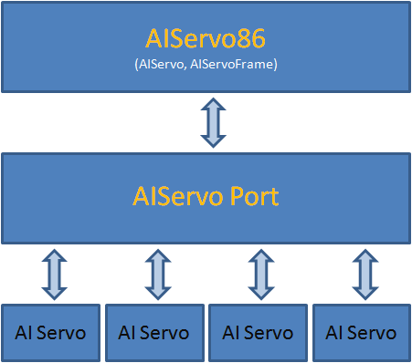

[86Duino IDE](http://www.86duino.com/?page_id=8918) 在下次更新中預計新增一個 AIServo86 涵式庫，此涵式庫可以說是 [Servo86](http://www.86duino.com/index.php?p=11050&lang=TW) 的 AI 伺服機版本。

原來的 Servo86 專注在 RC 伺服機控制上，而 AIServo86 則是專注在 AI 伺服機上（目前主要支援 Robotis Dynamixel 廠牌之伺服機，包含 AX-12、RX-28、MX-28、XL-320）。

## 程式架構
實際使用上可以參考 [AIServo86 涵式庫說明](http://www.86duino.com/index.php?p=16928&lang=TW)，且還有範例可供參考，這邊主要是分享此涵式庫的架構。在設計階段，為了要保留日後加入更多不同廠牌、型號的伺服機的彈性，使用了分層的方式進行抽象化，提出伺服機的核心功能進而實作出 AIServo86，具體架構如下圖：

如同 Servo86，AIServo86 中最核心的部分就是 AIServo 和 AIServoFrame 這兩個物件，AIServo 供使用者設定目標位置、運動時間、運動速度等特性，也提供了暫停、停止、釋放伺服機等命令讓機器人控制更加有彈性，而 AIServoFrame，則是導入 Frame 的概念，同時控制多顆伺服機來呈現機器人動作更加方便，除了這些以外還有較進階的 Cubic Spline 路徑規劃、Realtime Mixing 補償功能，這些功能也都已經加入了，有興趣的朋友可以看前兩篇 [[1](http://sayter99.github.io/2016/06/14/86ME%201.8/), [2](http://sayter99.github.io/2016/07/14/86ME%201.9/)] 相關的的文章。拉回程式架構身上，要讓 AIServo 和 AIServoFrame 可以正確支援多種不同控制方式的伺服機（可能有傳輸方式的不同，如 I2C、com port。或是 protocol 的不同，如 Dynamixel 1.0 和 Dynamixel 2.0），我們要再透過一個 AIServo Port 抽象化伺服機的控制方法，主要的方式就是 AIServoPort 裏頭有許多 virtual function，而這些用來控制伺服機的 virtual function 會依照伺服機不同的控制方式被實作在最下層，如此一來，以後要新增伺服機的支援時，就將底層需要用到的涵式搞定即可。也許大家會疑惑，這樣是不是有些專屬於某型號伺服機的功能是不是就用不到了，確實在 AIServo86 中沒有直接的將這些功能設計進去，但可以透過 AIServoPort 把自己想要的功能實作出來，以目前實作中的例子來說，XL-320 伺服機的 LED 燈功能，調整伺服機轉速功能等等都可以透過 AIServoPort 去呼叫了，所以功能完整性也是非常足夠的。

## 原始碼
對程式有興趣的朋友可以在這找到[原始碼](https://github.com/roboard/86Duino/tree/master/hardware/86duino/x86/libraries/AIServo86)，裏頭也有範例可供使用上的參考。

## DEMO
因為 PPAP 正夯的關係，同事就幫忙用 AIServo86 做了這個 DEMO 影片，影片內的機器狗使用的是 AX-12 伺服機 XD

