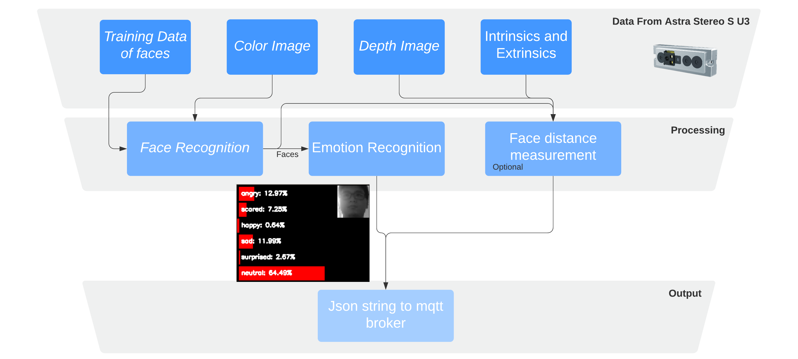

For aHRI class, we developed our face and emotion recognition [ROS package]((https://github.com/Sayter99/face_recognition_ultra_light)) based on pretrained models:
  * Face detection: [Ultra-light face detector](https://github.com/Linzaer/Ultra-Light-Fast-Generic-Face-Detector-1MB)
  * Face recognition: MobileFaceNet
  * Emotion recognition:
    * Arch: VGG networks4
    * Dataset: facial expression dataset (FER13 dataset)
    * Accuracy: 65.93%

We implemented two nodes for face recognition and emotion recognition. The face recognition node firstly detects human faces in images sent by an Astra Stereo S U3 camera, and conducts face recognition based on our trained face data. After recognition, the module outputs the face image along with the detected name and pixel location to the emotion recognition subscriber. Finally, the emotion recognition node processes the face images and outputs the result via MQTT to Austin, our Robotic Bat. There is an optional face distance measurement node in this package. It will compute the distance between the camera and the detected face based on the depth value of the detected face.

## Diagram

## RQT Graph

## Result

## References
* [Ultra-Light Fast Generic Face Detector](https://github.com/Linzaer/Ultra-Light-Fast-Generic-Face-Detector-1MB)
* [real time face recognition with cpu](https://towardsdatascience.com/real-time-face-recognition-with-cpu-983d35cc3ec5)
* [emotion recognition using keras](https://mc.ai/emotion-recognition-using-keras/)
* Chen, Sheng, et al. "Mobilefacenets: Efficient cnns for accurate real-time face verification on mobile devices." Chinese Conference on Biometric Recognition. Springer, Cham, 2018.
* Simonyan, Karen, and Andrew Zisserman. "Very deep convolutional networks for large-scale image recognition." arXiv preprint arXiv:1409.1556 (2014).